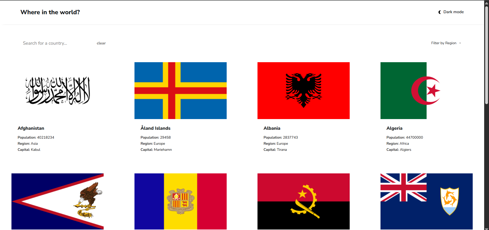
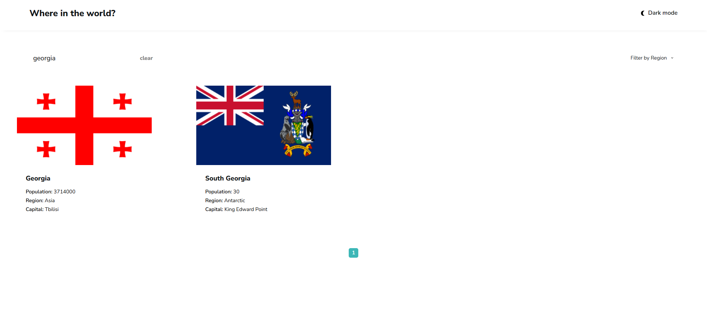
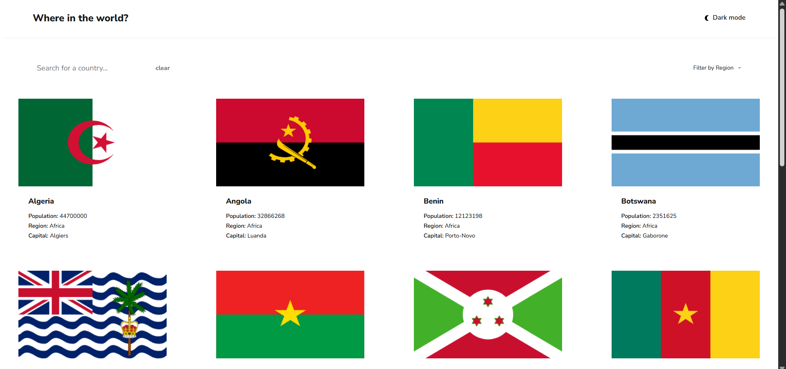
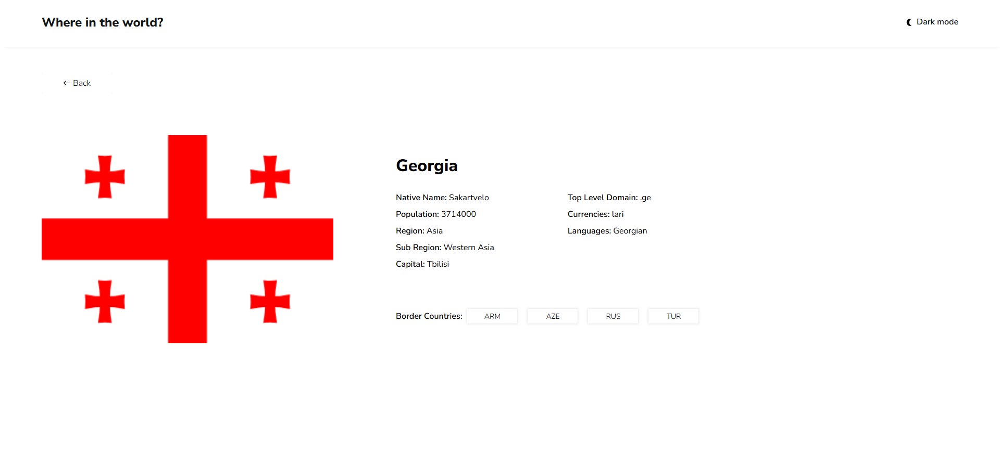
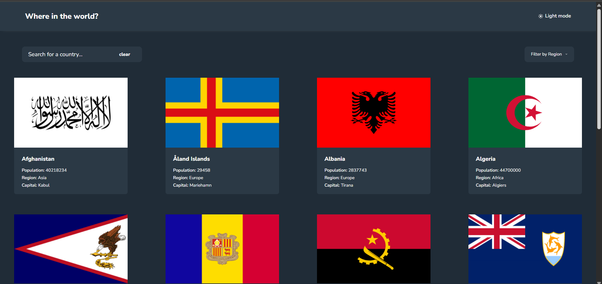

# 🌍 Rest Countries

This is my personal project built as part of the **Frontend Mentor** challenge. The goal was to create a web page that displays country flags, where you can **search for a country** and **view important details about each one**. This project showcases my skills in building clean, reusable, and responsive web interfaces using React and modern development tools.

---

## 🚀 Features

- 🇺🇳 Display countries in alphabetical order
- 🌎 Filter countries by region
- 🔍 Search for a specific country
- 🧩 Reusable components and organized structure
- 📄 Multiple pages with routing
- 📄 Paginated country list for better performance and user experience

---

## 🛠️ Tech Stack

- **React** – for building the user interface
- **React Router** – for handling client-side routing
- **Axios** – for fetching data from the API
- **useContext** – for managing global state
- **Local Storage** – to persist the theme (light/dark mode)

---

## 🧠 What I Learned

Working on this project improved my understanding of:

- Component-based architecture in React
- State management using `useContext`
- Routing and navigation in single-page applications
- Storing and retrieving data with Local Storage
- Implementing pagination for large datasets

---

## 📸 Screenshots

### 🌍 All Countries (Homepage)

### 🔍 Search in Action

### 📄 Country Detail Page

### 🌗 Dark Mode

---

## 👤 Author

**Vladimer Gabisonia**
GitHub: [vakkko](https://github.com/vakkko)
